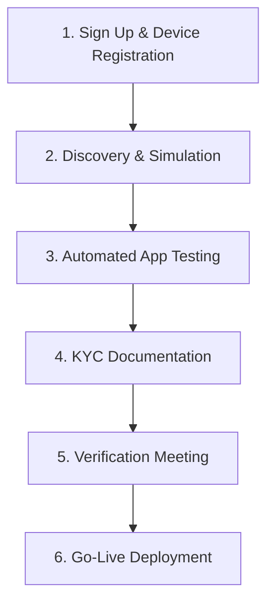

<p align="center">
  <a href="https://paybill.ke" target="_blank">
    <picture>
      <source media="(prefers-color-scheme: dark)" srcset="https://paybill.ke/logo-wordmark--dark.png">
      
    </picture>
  </a>
</p>

# KRA eTIMS OSCU Integration SDK (Python)


A production-ready **Python SDK** for integrating with the Kenya Revenue Authority (KRA) **eTIMS OSCU** (Online Sales Control Unit) API. Built to match the official Postman collection specifications with strict header compliance, token management, and comprehensive payload validation.

> ⚠️ **Critical Note**: This SDK implements the **new OSCU specification** (KRA-hosted), *not* the VSCU eTIMS API. OSCU requires device registration, headers, and `cmcKey` lifecycle management.

## Author
**Bartile Emmanuel**  
📧 ebartile@gmail.com | 📱 +254757807150  
*Lead Developer, Paybill Kenya*

---

## Table of Contents
- [Introduction to eTIMS OSCU](#introduction-to-etims-oscu)
- [OSCU Integration Journey](#oscu-integration-journey)
- [Critical Requirements](#critical-requirements)
- [Features](#features)
- [Installation](#installation)
- [Configuration](#configuration)
- [Usage Guide](#usage-guide)
- [API Reference](#api-reference)
- [Field Validation Rules](#field-validation-rules)
- [Error Handling](#error-handling)
- [Troubleshooting](#troubleshooting)
- [Automated Testing Requirements](#automated-testing-requirements)
- [KYC Documentation Checklist](#kyc-documentation-checklist)
- [Go-Live Process](#go-live-process)
- [Support](#support)
- [License](#license)
- [Attribution](#attribution)

---

## Introduction to eTIMS OSCU

KRA's **Electronic Tax Invoice Management System (eTIMS)** uses **OSCU** (Online Sales Control Unit) – a KRA-hosted software module that validates and signs tax invoices in real-time before issuance. Unlike VSCU, OSCU requires:

- Pre-registered device serial numbers (`dvcSrlNo`)
- Communication key (`cmcKey`) lifecycle management
- Strict payload schema compliance per KRA specifications

### Receipt Types & Labels Matrix

Each receipt is formed from a combination of receipt type and transaction type:

| RECEIPT TYPE | TRANSACTION TYPE | RECEIPT LABEL | DESCRIPTION |
|--------------|------------------|---------------|-------------|
| NORMAL       | SALES            | NS            | Standard tax invoice for customers |
| NORMAL       | CREDIT NOTE      | NC            | Refund/return invoice |
| COPY         | SALES            | CS            | Reprint with "Copy" watermark |
| COPY         | CREDIT NOTE      | CC            | Reprint of credit note |
| TRAINING     | SALES            | TS            | Training mode (no tax impact) |
| TRAINING     | CREDIT NOTE      | TC            | Training credit note |
| PROFORMA     | SALES            | PS            | Quote/proforma invoice |

### Tax Category Codes

KRA requires tax breakdown across 5 categories in all sales/purchase transactions:

| Code | Description | Standard Rate | Notes |
|------|-------------|---------------|-------|
| **A** | VAT Standard | 16% | Most goods/services |
| **B** | VAT Special | 8% / 14% | Petroleum products, etc. |
| **C** | Zero-rated | 0% | Exports, humanitarian aid |
| **D** | Exempt | 0% | Financial services, education |
| **E** | Non-taxable | 0% | Insurance, residential rent |

> 💡 **Critical**: All 15 tax fields required in payloads:  
> `taxblAmtA/B/C/D/E`, `taxRtA/B/C/D/E`, `taxAmtA/B/C/D/E`

---

## OSCU Integration Journey

KRA mandates a strict 6-phase integration process before production deployment:



### Phase 1: Sign Up & Device Registration
1. Register on [eTIMS Taxpayer Sandbox Portal](https://etims-sbx.kra.go.ke)
2. Submit Service Request → Select "eTIMS" → Choose "OSCU" type
3. Await SMS confirmation of OSCU approval
4. **Critical**: Device serial number (`dvcSrlNo`) is provisioned during this phase

### Phase 2: Discovery & Simulation
- Create application on [GavaConnect Developer Portal](https://developer.go.ke)
- Obtain sandbox credentials:
  - Consumer Key/Secret (for token generation)
  - Approved device serial number (`dvcSrlNo`)

### Phase 3: Automated App Testing
- Run integration tests against sandbox environment
- **Critical**: Upload test artifacts within **1 hour** of test completion:
  - Item creation screenshot
  - Invoice generation screenshot
  - Sample invoice copy (PDF/print)
  - Credit note copy (PDF/print)

### Phase 4: KYC Documentation
**Third-Party Integrators Must Submit**:
- [ ] eTIMS Bio Data Form (completed)
- [ ] Certificate of Incorporation / Business Registration + CR12
- [ ] Valid Business Permit
- [ ] National IDs of directors/partners/sole proprietor
- [ ] Company Tax Compliance Certificate (valid)
- [ ] Proof of 3+ qualified technical staff (CVs + certifications)
- [ ] Notarized solvency declaration
- [ ] Technology Architecture document (TIS ↔ eTIMS integration diagram)

**Self-Integrators Only Need**:
- [ ] Items 1, 5, 6, and 8 from above list

### Phase 5: Verification Meeting
- Schedule demo via Developer Portal
- Demonstrate:
  - Invoice data database structure
  - Credit note database structure
  - Complete invoice format (with OSCU signatures)
  - Item creation workflow
  - Stock management integration
- Address KRA feedback within 48 hours if failed

### Phase 6: Go-Live Deployment
- Execute SLA with KRA (third-party integrators only)
- Receive production keys via Developer Portal
- Deploy to production environment
- Monitor compliance for first 30 days

---

## Critical Requirements

Before integration, you **MUST** complete these prerequisites:

### 1. Device Registration (MANDATORY)
- Register OSCU device via [eTIMS Taxpayer Production Portal](https://etims.kra.go.ke) 
- Register OSCU device via [eTIMS Taxpayer Sandbox Portal](https://etims-sbx.kra.go.ke) 
- Obtain **approved device serial number** (`dvcSrlNo`)
- ⚠️ **Dynamic/unregistered device serials fail with `resultCd: 901`** ("It is not valid device")

### 2. Communication Key Lifecycle
```python
# 1. Initialize FIRST (returns cmcKey)
response = etims.select_init_osdc_info({
    "tin": config["oscu"]["tin"],
    "bhfId": config["oscu"]["bhf_id"],
    "dvcSrlNo": config["oscu"]["device_serial"],  # KRA-approved serial
})

# 2. Extract cmcKey
cmc_key = response.get("cmcKey")

# 3. Update config IMMEDIATELY
config["oscu"]["cmc_key"] = cmc_key

# 4. Recreate client with updated config (critical!)
etims = EtimsClient(config, auth)
```

> 🔔 Note: `cmcKey` is only required for certain write operations (branch/user/insurance), not all endpoints.

### 3. Invoice Numbering Rules
- **MUST be sequential integers** (1, 2, 3...) – **NOT strings** (`INV001`)
- Must be unique per branch office (`bhfId`)
- Cannot be reused even after cancellation
- KRA rejects non-integer invoice numbers with `resultCd: 500`

### 4. Date Format Specifications
| Field | Format | Example | Validation Rule |
|-------|--------|---------|-----------------|
| `salesDt`, `pchsDt`, `ocrnDt` | `YYYYMMDD` | `20260131` | Cannot be future date |
| `cfmDt`, `stockRlsDt`, `rcptPbctDt` | `YYYYMMDDHHmmss` | `20260131143022` | Must be current/past |
| `lastReqDt` | `YYYYMMDDHHmmss` | `20260130143022` | Cannot be future date; max 7 days old |

---

## Features

✅ **Postman Collection Compliance**  
- 100% header, path, and payload alignment with official KRA Postman collection  
- Correct nested paths (`/insert/stockIO`, `/save/stockMaster`)  
- All 8 functional categories implemented  

✅ **Strict Header Management**  
| Endpoint Type | Required Headers | Initialization Exception |
|---------------|------------------|--------------------------|
| **Initialization** | `Authorization` | ❌ NO `tin`/`bhfId`/`cmcKey` |
| **All Other Endpoints** | `Authorization`, `tin`, `bhfId`, `cmcKey` | ✅ Full header set |

✅ **Token Lifecycle Management**  
- Automatic token caching with 60-second buffer  
- Transparent token refresh on 401 errors  
- File-based cache with configurable location  

✅ **Comprehensive Validation**  
- Pydantic v2 schemas matching KRA specifications  
- Field-level validation with human-readable errors  
- Date format enforcement (`YYYYMMDDHHmmss`)  
- Tax category validation (A/B/C/D/E)  

✅ **Production Ready**  
- SSL verification enabled by default  
- Timeout configuration (default: 30s)  
- Environment-aware (sandbox/production)  
- Detailed error diagnostics with KRA fault strings  

---

## Installation

```bash
pip install kra-etims-sdk
```

### Requirements
- Python 3.9+
- `requests` (≥2.31)
- `pydantic` (≥2.0)

> 💡 The SDK uses plain dictionaries for configuration — no custom config class required.

---

## Configuration

Define your config as a **plain Python dictionary**:

```python
import os
import tempfile

config = {
    'env': 'sbx',  # 'sbx' = sandbox, 'prod' = production
    'cache_file': os.path.join(tempfile.gettempdir(), 'kra_etims_token.json'),
    'auth': {
        'sbx': {
            'token_url': 'https://sbx.kra.go.ke/v1/token/generate',
            'consumer_key': os.getenv('KRA_CONSUMER_KEY'),
            'consumer_secret': os.getenv('KRA_CONSUMER_SECRET'),
        }
    },
    'api': {
        'sbx': {'base_url': 'https://etims-api-sbx.kra.go.ke/etims-api'}
    },
    'http': {'timeout': 30},
    'oscu': {
        'tin': os.getenv('KRA_TIN'),
        'bhf_id': os.getenv('KRA_BHF_ID') or '01',
        'device_serial': os.getenv('DEVICE_SERIAL'),
        'cmc_key': '',  # populated after initialization
    }
}
```

> ✅ **Required environment variables**:  
> `KRA_CONSUMER_KEY`, `KRA_CONSUMER_SECRET`, `KRA_TIN`, `DEVICE_SERIAL`  
>  
> ⚠️ **Never include trailing spaces in URLs** — they cause silent connection failures.

---

## Usage Guide

### Step 1: Initialize SDK
```python
from kra_etims_sdk.auth import AuthClient
from kra_etims_sdk.client import EtimsClient

auth = AuthClient(config)
etims = EtimsClient(config, auth)
```

### Step 2: Authenticate
```python
try:
    auth.forget_token()  # Clear cached token
    token = auth.token(force=True)
    print(f"✅ Token OK: {token[:25]}...")
except Exception as e:
    print(f"❌ Authentication failed: {e}")
    exit(1)
```

### Step 3: OSCU Initialization (If Needed)
> Only required for `cmcKey`-dependent operations (e.g., saving branch users or insurance).

```python
try:
    init_resp = etims.select_init_osdc_info({
        'tin': config['oscu']['tin'],
        'bhfId': config['oscu']['bhf_id'],
        'dvcSrlNo': config['oscu']['device_serial'],
    })
    
    cmc_key = init_resp.get('cmcKey')
    if not cmc_key:
        raise RuntimeError("cmcKey not found in response")

    config['oscu']['cmc_key'] = cmc_key
    etims = EtimsClient(config, auth)  # Reinitialize to inject cmcKey
    print(f"✅ OSCU initialized. cmcKey: {cmc_key[:15]}...")

except Exception as e:
    print(f"❌ OSCU Init failed: {e}")
    exit(1)
```

### Step 4: Business Operations
```python
# Fetch code list
codes = etims.select_code_list({'lastReqDt': '20260101000000'})

# Save an item
item_resp = etims.save_item({
    'itemCd': 'KE1NTXU0000006',
    'itemClsCd': '5059690800',
    'itemNm': 'Test Material',
    'pkgUnitCd': 'NT',
    'qtyUnitCd': 'U',
    'taxTyCd': 'B',
    'dftPrc': 3500,
    'useYn': 'Y',
    'regrId': 'Test', 'regrNm': 'Test',
    'modrId': 'Test', 'modrNm': 'Test',
})

# Save purchase transaction (full tax breakdown required)
purchase_resp = etims.save_purchase({
    'invcNo': 1,
    'spplrTin': 'A123456789Z',
    'pchsTyCd': 'N',
    'rcptTyCd': 'P',
    'pmtTyCd': '01',
    'pchsSttsCd': '02',
    'cfmDt': '20260206120000',
    'pchsDt': '20260206',
    'totItemCnt': 1,
    'taxblAmtA': 0, 'taxblAmtB': 10500, 'taxblAmtC': 0, 'taxblAmtD': 0, 'taxblAmtE': 0,
    'taxRtA': 0, 'taxRtB': 18, 'taxRtC': 0, 'taxRtD': 0, 'taxRtE': 0,
    'taxAmtA': 0, 'taxAmtB': 1890, 'taxAmtC': 0, 'taxAmtD': 0, 'taxAmtE': 0,
    'totTaxblAmt': 10500,
    'totTaxAmt': 1890,
    'totAmt': 10500,
    'regrId': 'Test', 'regrNm': 'Test',
    'modrId': 'Test', 'modrNm': 'Test',
    'itemList': [/* ... */],
})
```

> ✅ All payloads are validated using internal Pydantic schemas before sending.

---

## API Reference

### Functional Categories & Methods

| Category | Methods |
|--------|--------|
| **Initialization** | `select_init_osdc_info()` |
| **Data Management** | `select_code_list()`, `select_customer()`, `select_notice_list()`, `select_branches()`, `select_item_classes()`, `select_items()` |
| **Branch Management** | `save_branch_customer()`, `save_branch_user()`, `save_branch_insurance()` |
| **Item Management** | `save_item()`, `save_item_composition()` |
| **Purchase Management** | `save_purchase()`, `select_purchases()` |
| **Sales Management** | `save_sales_transaction()` |
| **Stock Management** | `save_stock_io()`, `save_stock_master()`, `select_stock_movement()` |

> 🔍 Each method maps to a KRA endpoint alias defined internally (e.g., `save_purchase` → `insertTrnsPurchase`).

---

## Field Validation Rules (From Postman Collection)

| Field | Validation Rule | Error if Violated |
|-------|-----------------|-------------------|
| `dvcSrlNo` | Must be pre-registered with KRA | `resultCd: 901` "It is not valid device" |
| `lastReqDt` | Cannot be future date; max 7 days old | `resultCd: 500` "Check request body" |
| `salesDt` | Must be `YYYYMMDD` format; not future | `resultCd: 500` |
| `cfmDt` | Must be `YYYYMMDDHHmmss` format | `resultCd: 500` |
| `invcNo` | Must be sequential integer (not string) | `resultCd: 500` |
| `taxTyCd` | Must be A/B/C/D/E | `resultCd: 500` |
| `itemCd` | Must exist in KRA system (for transactions) | `resultCd: 500` |
| `pkg` | Must be ≥ 1 | `resultCd: 500` |
| `qty` | Must be > 0.001 | `resultCd: 500` |
| `dcRt` | Cannot be negative | `resultCd: 500` |

---

## Error Handling

### Exception Types

| Exception | When Thrown | Example |
|-----------|-------------|---------|
| `AuthenticationException` | Token generation fails | Invalid consumer key/secret |
| `ApiException` | KRA business error (`resultCd !== '0000'`) | `resultCd: 500` (invalid payload) |
| `ValidationException` | Payload fails schema validation | Missing required field |

### Handling Pattern
```python
try:
    response = etims.save_purchase(payload)
    
except ValidationException as e:
    print("❌ Validation failed:")
    for field, msg in e.details.items():
        print(f"  • {field}: {msg}")

except ApiException as e:
    print(f"❌ KRA API Error ({e.error_code}): {e}")
    if e.details and 'resultMsg' in e.details:
        print(f"KRA Message: {e.details['resultMsg']}")

except AuthenticationException as e:
    print(f"❌ Authentication failed: {e}")
```

### Comprehensive KRA Error Codes

| Code | Meaning | Solution |
|------|---------|----------|
| `0000` | Success | ✅ Operation completed |
| `901` | "It is not valid device" | Use KRA-approved device serial |
| `902` | "Invalid cmcKey" | Re-initialize OSCU to get fresh cmcKey |
| `500` | "Check request body" | Validate payload against Postman schema |
| `501` | "Mandatory information missing" | Check required fields per endpoint |
| `502` | "Invalid format" | Fix date formats / data types |
| `503` | "Data not found" | Verify TIN/branch/item exists in KRA system |
| `504` | "Duplicate data" | Use unique invoice number |
| `505` | "Data relationship error" | Check parent-child relationships |
| `401` | "Unauthorized" | Check token validity header |
| `429` | "Rate limit exceeded" | Implement request throttling (max 100 req/min) |

---

## Troubleshooting

### ❌ "It is not valid device" (resultCd: 901)

**Cause**: Device serial not registered with KRA sandbox  
**Solution**:
1. Email `timsupport@kra.go.ke` with subject:  
   `"Request for OSCU Sandbox Test Credentials - [Your Company Name] - PIN: [Your PIN]"`
2. Use **static** approved serial (e.g., `dvcv1130`) – never generate dynamically
3. Verify TIN/branch ID match registered device

### ❌ "Invalid cmcKey" (resultCd: 902)

**Cause**: cmcKey expired or not set in config  
**Solution**:
```python
config['oscu']['cmc_key'] = extracted_cmc_key
etims = EtimsClient(config, auth)  # MUST recreate client
```

### ❌ Trailing spaces in URLs

**Cause**: Copy-paste errors from documentation  
**Solution**: Always verify URLs have no trailing whitespace.

### ❌ Invoice number rejected

**Cause**: Using string prefix (`INV001`) instead of integer  
**Solution**: Use sequential integers starting from 1:
```python
"invcNo": 1,  # ✅ Correct
```

---

## Automated Testing Requirements

KRA mandates successful completion of automated tests before verification:

### Test Execution Flow
1. Run integration tests against sandbox environment
2. System validates:
   - Token generation
   - OSCU initialization
   - Code list retrieval
   - Item creation
   - Sales transaction with full tax breakdown
   - Invoice retrieval
3. Upon success, system provides **1-hour window** to upload artifacts

### Required Artifacts (Upload Within 1 Hour)
| Artifact | Format | Requirements |
|----------|--------|--------------|
| Item Creation Screenshot | PNG/JPEG | Must show item code, tax category, price |
| Invoice Generation Screenshot | PNG/JPEG | Must show OSCU signatures, QR code |
| Invoice Copy | PDF | Full invoice with all KRA-mandated fields |
| Credit Note Copy | PDF | Must show original invoice reference |

> ⚠️ **Failure to upload within 1 hour** = Test invalidated → Must re-run entire test suite

---

## KYC Documentation Checklist

### Third-Party Integrators (All Required)
- [ ] eTIMS Bio Data Form (completed with director details)
- [ ] Certificate of Incorporation + CR12 (or Business Registration Certificate)
- [ ] Valid Business Permit (current year)
- [ ] National IDs of all directors/partners
- [ ] Company Tax Compliance Certificate (valid for current year)
- [ ] Proof of 3+ qualified technical staff:
  - CVs showing Python/Java/C# experience
  - Certifications (e.g., AWS, Azure, KRA eTIMS training)
  - Employment contracts showing system administration duties
- [ ] Notarized solvency declaration (signed by director + notary public)
- [ ] Technology Architecture document:
  - System diagram showing TIS ↔ OSCU data flow
  - Database schema for invoice storage
  - Security measures (encryption, access controls)
  - Disaster recovery plan

### Self-Integrators (Minimal Set)
- [ ] eTIMS Bio Data Form
- [ ] Company Tax Compliance Certificate
- [ ] National ID of sole proprietor/director
- [ ] Technology Architecture document (simplified)

---

## Go-Live Process

### For Third-Party Integrators
1. Upon KYC approval, receive SLA template via Developer Portal
2. Complete SLA with company details and authorized signatory
3. Email signed SLA to `timsupport@kra.go.ke` with subject:  
   `"SLA Execution with KRA - [Your Company Name]"`
4. Await KRA approval (5-7 business days)
5. Receive production keys via Developer Portal:
   - Production consumer key/secret
6. Deploy to production environment (`api.developer.go.ke`)
7. Monitor compliance for first 30 days (KRA conducts spot checks)

### For Self-Integrators
1. Receive interim approval letter after KYC verification
2. Receive production keys via Developer Portal
3. Deploy directly to production environment
4. No SLA execution required

> 💡 **Production URL**: `https://etims-api.kra.go.ke/etims-api`  
> ⚠️ **Never use sandbox credentials in production** – KRA monitors environment separation strictly

---

## Support

### KRA Official Support Channels
| Purpose | Contact | Expected Response |
|---------|---------|-------------------|
| Sandbox credentials & device registration | `timsupport@kra.go.ke` | 1-3 business days |
| API technical issues & Postman collection | `apisupport@kra.go.ke` | 24-48 hours |
| Developer Portal access issues | `apisupport@kra.go.ke` | 24 hours |
| Verification meeting scheduling | Developer Portal UI | Instant (self-service) |
| SLA execution queries | `timsupport@kra.go.ke` | 3-5 business days |

### SDK Support
- **GitHub Issues**: [github.com/paybillke/kra-etims-python-sdk/issues](https://github.com/paybillke/kra-etims-python-sdk/issues)
- **Email**: ebartile@gmail.com (for integration guidance)
- **Emergency Hotline**: +254757807150 (business hours only)

> ℹ️ **Disclaimer**: This SDK is independently developed by Paybill Kenya and is **not affiliated with or endorsed by the Kenya Revenue Authority (KRA)**. Always verify integration requirements with KRA before production deployment. KRA may update API specifications without notice – monitor [GavaConnect Portal](https://developer.go.ke) for updates.

---

## License

MIT License

Copyright © 2024–2026 Bartile Emmanuel / Paybill Kenya

Permission is hereby granted, free of charge, to any person obtaining a copy
of this software and associated documentation files (the "Software"), to deal
in the Software without restriction, including without limitation the rights
to use, copy, modify, merge, publish, distribute, sublicense, and/or sell
copies of the Software, and to permit persons to whom the Software is
furnished to do so, subject to the following conditions:

The above copyright notice and this permission notice shall be included in all
copies or substantial portions of the Software.

THE SOFTWARE IS PROVIDED "AS IS", WITHOUT WARRANTY OF ANY KIND, EXPRESS OR
IMPLIED, INCLUDING BUT NOT LIMITED TO THE WARRANTIES OF MERCHANTABILITY,
FITNESS FOR A PARTICULAR PURPOSE AND NONINFRINGEMENT. IN NO EVENT SHALL THE
AUTHORS OR COPYRIGHT HOLDERS BE LIABLE FOR ANY CLAIM, DAMAGES OR OTHER
LIABILITY, WHETHER IN AN ACTION OF CONTRACT, TORT OR OTHERWISE, ARISING FROM,
OUT OF OR IN CONNECTION WITH THE SOFTWARE OR THE USE OR OTHER DEALINGS IN THE
SOFTWARE.

---

## Attribution

This SDK was developed by **Bartile Emmanuel** for Paybill Kenya to simplify KRA eTIMS OSCU integration for Kenyan businesses. Special thanks to KRA for providing comprehensive API documentation and Postman collections.

> 🇰🇪 **Proudly Made in Kenya** – Supporting digital tax compliance for East Africa's largest economy.  
